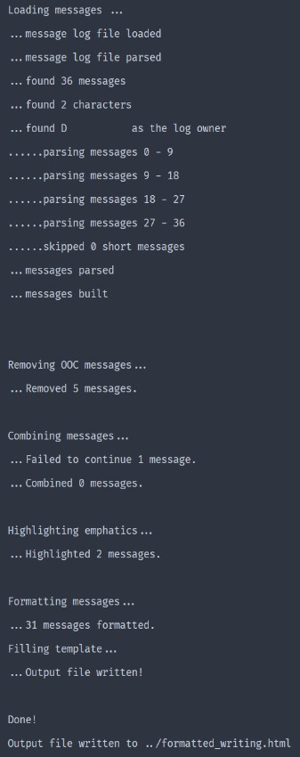
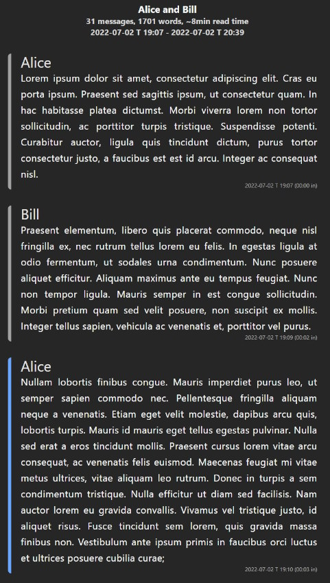

# XIVRP-Formatter

This is designed to take your logs from your roleplaying sessions in FFXIV and format them up into
a nice looking HTML page, that's easy to re-read, share with others, an embed pictures into.

Besides formatting it into a simple, readability-focused, HTML page, it also works to make your
sessions easier and more enjoyable to read by converting simple formatting into styled HTML,
combining continued messages, removing unrelated messages, embedding images intelligently, and
picking your session out of the noise of a busy venue.

## Features

All of these are optional and can be turned on or off as you like per-run

- Remove Out-Of-Character messages from the log.
- Highlight `~emphatic~ /text/ *used*` in the log.
- Combine messages that are continued, with various detections for this.
- Embed images depending on when they were taken during the session.
- Find gaps in sessions that spanned multiple sittings and remove them, for real writing lengths.

<details><summary style="cursor:pointer"><h3 style="display:inline">Planned Features</h3></summary>

(Roughly in order of priority)

- Command line arguments to skip prompts and just run the program.
- Finding sessions within a larger log.
- Finding sessions across multiple formats provided at once
- Images with `COVER` in their name to be displayed more prominently in some way
- Better mobile display.
- Profile images that match character names in the provided log.
- Finding images automatically. (e.g. finding your XIV folder and checking for screenshots, or
  finding your gshade/reshade settings and checking where screenshots are saved)
- Finding a roleplay session within a larger log.
- More detection for continued messages, e.g. simply the same person talking twice in a row.
- Finding more than one roleplay session in a log, or combining multiple sessions in a larger
  log into one.
- Option to save settings to file, to load when used with command line arguments.
- Finding log files automatically. (e.g. finding your XIVLauncher folder and checking where the
  plugins store their logs)

</details>

## Instructions

- Check [releases](https://github.com/zbee/xivrp-formatter/releases) for the latest version.
- Download the `XIVRP-Formatter.zip` file and extract it somewhere.
- Place your logs next to the executable.
- Place any images taken during the session next to the executable.
- Run the executable and follow the prompts.
- Open the generated HTML file in your browser.

## Examples



## Supports

The following log types are supported:

- [ChatScan](https://github.com/serifine/XIV-Chat-Scanner) logs
- PNG Images in the same folder as the chat logs

### Planned Support

The following log types are planned for future support:

- Discord chat copy-paste (or pasted into a file)
- [Chat 2](https://git.anna.lgbt/anna/ChatTwo/src/branch/main/ChatTwo) database
- [GobChat](https://github.com/MarbleBag/Gobchat) logs
- [XIVLogger](https://github.com/cadaeix/XIVLogger) logs

## Building

I don't know, this is my first c++ project, after building the core of this for a class project.

Theoretically, it should just be good to go as is in c++20 with cmake.

It was built in CLion with a bundled Cygwin toolchain, releases with a bundled MinGW toolchain, and
only tested on Windows 10. This, along with the `.idea/` folder -which includes the run and
build configs- should produce a workable build.

## License

This software is licensed under GPLv3, and as such can be shared and modified freely.

`XIVRP-Formatter  Copyright (C) 2024  Ethan Henderson <ethan@zbee.codes>`

```
This program is free software: you can redistribute it and/or modify
it under the terms of the GNU General Public License as published by
the Free Software Foundation, either version 3 of the License, or
(at your option) any later version.

This program is distributed in the hope that it will be useful,
but WITHOUT ANY WARRANTY; without even the implied warranty of
MERCHANTABILITY or FITNESS FOR A PARTICULAR PURPOSE.  See the
GNU General Public License for more details.

You should have received a copy of the GNU General Public License
along with this program.  If not, see <https://www.gnu.org/licenses/>.
```

## Attribution

- [nlohman's JSON library](https://github.com/nlohmann/json)
- [HowardHinnant's date library](https://github.com/HowardHinnant/date)
- [Tomáš Andrle's templating library](https://www.catnapgames.com/2013/04/09/nltemplate-html-template-library-for-c/)
- [heifner's base64 library](https://github.com/heifner/base64)
- [tailwindlabs' tailwindcss](https://github.com/tailwindlabs/tailwindcss)
